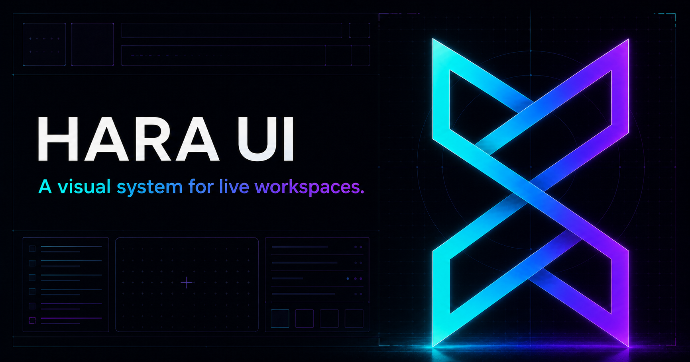

# Hara UI

Framework-free, versioned UI primitives for Hara properties. It is the shared
source for the website, the static specification explorer, and browser tools.

Open `index.html` to see the component system in use.



## Contents

- `tokens.css` — canonical editor palette, with both `--hara-*` and legacy
  website aliases.
- `components.css` — buttons, inputs, badges, source blocks, and syntax tokens.
- `spec-explorer.css` and `spec-explorer.js` — a static manifest-driven viewer
  for Markdown, EDN, and JSON specifications.
- `menu-bar.js` — desktop menu-bar disclosure behavior for `.hara-menu-bar`.
- `workspace.js` — accessible tabs and code↔visual action event bindings.
- `workbench.js` — dock-first DOM/SVG patch workbench with typed core-flow ports.
- `docs/workspace-interface.md` — VS Code/Blender/Max-style workspace spec.
- `docs/code-visual-links.md` — code ↔ visual link controls and states.

## Static use

```html
<link rel="stylesheet" href="vendor/hara-ui/tokens.css">
<link rel="stylesheet" href="vendor/hara-ui/components.css">
<link rel="stylesheet" href="vendor/hara-ui/spec-explorer.css">
<main id="specs"></main>
<script type="module">
  import { createSpecExplorer } from "./vendor/hara-ui/spec-explorer.js";
  createSpecExplorer(document.querySelector("#specs"), {
    manifestUrl: "spec-manifest.json",
    repositoryUrl: "https://github.com/hara-lang/hara-specs/blob/main"
  });
</script>
```

Chrome extension builds must copy these files into the packaged extension;
Manifest V3 does not permit remotely hosted executable code.
