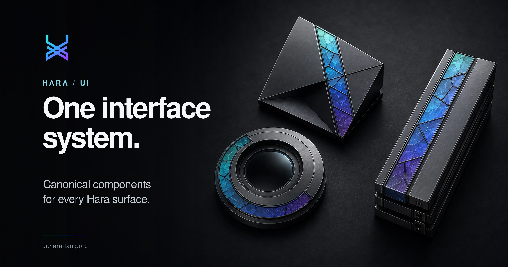

# Hara UI

Framework-free, versioned UI primitives for Hara properties. It is the shared
source for the website, the static specification explorer, browser tools and the
Hara document surface.

Open `index.html` to see the component system. Open `document-demo.html` for a
local-first word-processing surface with directly embedded Hara artefacts.



## Contents

- `tokens.css` — canonical editor palette, with both `--hara-*` and legacy
  website aliases.
- `components.css` — buttons, inputs, badges, source blocks, and syntax tokens.
- `spec-explorer.css` and `spec-explorer.js` — a static manifest-driven viewer
  for Markdown, EDN, and JSON specifications.
- `menu-bar.js` — desktop menu-bar disclosure behavior for `.hara-menu-bar`.
- `workspace.js` — accessible tabs and code↔visual action event bindings.
- `workbench.js` — dock-first DOM/SVG patch workbench with typed core-flow ports.
- `document-model.js` — canonical `greenways.rich-text/2` values and
  Hestia-compatible operations.
- `document-editor.js` and `document.css` — the browser document surface and
  embedded Hara artefact node view.
- `document-hestia.js` — submission adapter that resolves stable artefact node
  and source-text IDs before a batch enters Hestia OT.
- `packages/web-*` — portable runtime, editor, workspace, preview, and capability
  components used by Live, Playground, Catalog, and Studio compositions.
- `docs/web-packages.md` — package ownership, dependency, and migration rules.
- `docs/workspace-interface.md` — VS Code/Blender/Max-style workspace spec.
- `docs/code-visual-links.md` — code ↔ visual link controls and states.

## Hara documents

A Hara document is a stable-ID AST. Prose blocks and embedded artefacts share
one canonical tree. An artefact contains a normal text child for HAL source, so
source edits use the same Hestia `text.splice` operation as prose. The kernel's
live result is ephemeral until the author commits a snapshot operation with the
exact source and result roots.

```js
import { createHaraDocumentEditor } from "@hara-lang/ui/document-editor";
import { createHestiaDocumentClient } from "@hara-lang/ui/document-hestia";
import {
  createArtefactBlock,
  createDocument,
  createTextBlock
} from "@hara-lang/ui/document-model";
import "@hara-lang/ui/document.css";

const document = createDocument({
  title: "Quarterly review",
  blocks: [
    createTextBlock("heading", "Quarterly review", { level: 1 }),
    createTextBlock("paragraph", "The current forecast is embedded below."),
    createArtefactBlock({
      kind: "table",
      title: "Forecast",
      source: "(forecast/table :quarterly)"
    })
  ]
});

const collaboration = createHestiaDocumentClient({
  submit: (batch) => hestia.post(`/v1/documents/${batch.documentId}/imports`, batch),
  onConflict: (receipt) => showConflict(receipt)
});

createHaraDocumentEditor(document.querySelector("#document"), {
  document,
  async evaluateArtefact({ source, namespace }) {
    return haraKernel.eval(source, namespace);
  },
  onBatch(batch, nextDocument) {
    collaboration.submit(nextDocument, batch);
  }
});
```

The initial artefact kinds are `value`, `view`, `table`, `chart`, `canvas`,
`query`, `agent`, and `custom`. HTML views are projected in a sandboxed iframe;
ordinary values and tables remain host-rendered. The surface never makes HTML
the canonical document representation.

## Hestia collaboration boundary

The editor emits batches compatible with the Greenways Document Operations and
Provenance Protocol. Hestia owns sequencing, operational transformation,
conflicts, signed receipts, approvals and delivery. Hara UI performs optimistic
local projection only. A remote accepted or transformed batch should be applied
to the canonical document and supplied back through `setDocument()`.

`prepareHestiaBatch()` enriches each `artefact.commit` with its stable artefact
node and source text IDs. Hestia can therefore transform against intervening
source edits and also verify the exact source root at admission. The helper does
not sign, sequence, hash or submit the batch.

Live artefact results are not automatically signed. `Commit snapshot` emits an
`artefact.commit` operation containing the source root, result root, media type
and concise display. Later edits preserve the historical snapshot receipt while
making the new source a distinct working state.

## Static use

```html
<link rel="stylesheet" href="vendor/hara-ui/tokens.css">
<link rel="stylesheet" href="vendor/hara-ui/components.css">
<link rel="stylesheet" href="vendor/hara-ui/spec-explorer.css">
<main id="specs"></main>
<script type="module">
  import { createSpecExplorer } from "./vendor/hara-ui/spec-explorer.js";
  createSpecExplorer(document.querySelector("#specs"), {
    manifestUrl: "spec-manifest.json",
    repositoryUrl: "https://github.com/hara-lang/hara-specs/blob/main",
    titlePrefix: "Hara / Specs"
  });
</script>
```

`titlePrefix` is optional. When provided, the explorer uses it for the initial
document title and breadcrumb, then appends only the selected filename.

Chrome extension builds must copy these files into the packaged extension;
Manifest V3 does not permit remotely hosted executable code.

## Validation

```sh
npm install --ignore-scripts
npm test
npm run check
```
